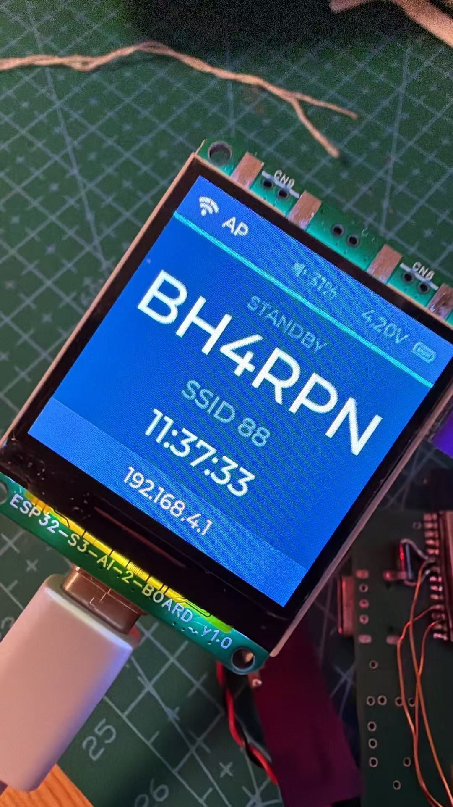
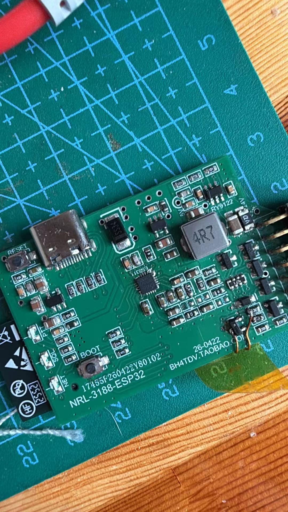
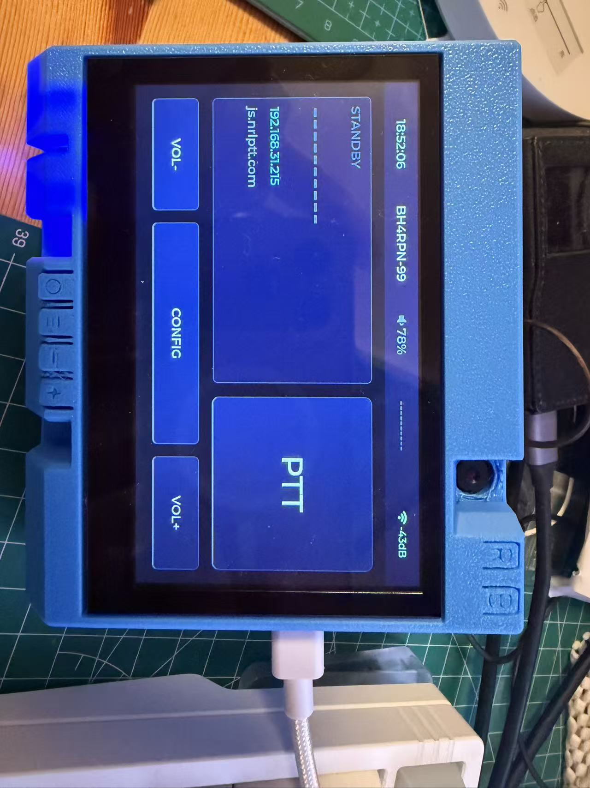

# NRL ESP32 Radio Bridge

[Chinese manual](README.md) · HTML: [Chinese](README.html) / [English](README.en.html)

Current firmware version: `0.8.2`

This project is an NRL network-radio bridge firmware primarily targeting ESP32-S31, while retaining support for ESP32-S3 boards. It brings radio audio, PTT, SQL, channel selection, SCI serial passthrough, and network configuration into one embedded application. Board targets use the appropriate audio codec, including ES8311 or ES8389; the project covers Moto3188/NRL hardware and ESP32-S31 development boards.

## Supported Boards

Every target shares the NRL network-voice stack, Wi-Fi provisioning portal, remote AT commands, and Wi-Fi OTA updates. BLE provisioning is available on ESP32-S3; ESP32-S31 uses the touch configuration UI (Korvo) or the SoftAP portal. Select the build target that matches the physical board; board-specific capabilities are listed below.

| Build target | Board / SoC | On-board and supported functions | Intended use |
| --- | --- | --- | --- |
| `gezipai` | Gezipai, ESP32-S3 | ES7210 microphone ADC + ES8311 DAC, 240×240 ST7789 colour display, battery-voltage sensing, volume up/down/PTT buttons, three status LEDs, SCI serial | Portable network-voice terminal with a small display and physical PTT |
| `bh4tdv` | BH4TDV NRL-3188 / Moto3188 controller, ESP32-S3 | ES8311 full-duplex audio, PTT/SQL/three status LEDs, three-bit channel select (0–7), SCI serial; no on-board display | Network bridge and channel controller for a 3188 radio |
| `s31_korvo` | ESP32-S31-Korvo-1, ESP32-S31 | ES8389 audio, 800×480 RGB touch display, ADC buttons (volume, mode, PTT), TF card, USB-OTG host, on-board RGB status LED | Touch-based multimedia and network-voice terminal; UART1/SCI and UART2/GPS default to off and can be enabled through Web/AT |
| `s31_function_coreboard` | ESP32-S31-Function-CoreBoard-1, ESP32-S31 | ES8311 audio, YT8531 Gigabit Ethernet, USB-A host, WS2812 RGB status LED, SCI serial; no display or physical volume/PTT buttons | Function-core design requiring wired networking or USB storage |

### Board Photos and UI

<div align="center">
  
  
  
</div>

From left to right: the Gezipai ESP32-S3 terminal, BH4TDV NRL-3188 controller, and ESP32-S31-Korvo touch-terminal UI. All images are local assets from `docs/`.

### ESP32-S31 Board Photos

<div align="center">
  
  
</div>

The left image is the ESP32-S31-Korvo-1 used by `s31_korvo`, with display, touch, TF-card, USB-host, and audio peripherals. The right image is the ESP32-S31-Function-CoreBoard-1 used by `s31_function_coreboard`, with RJ45 Gigabit Ethernet, USB-A host, on-board audio, and an RGB status LED.

> USB web flashing is available only for the ESP32-S3 targets, `gezipai` and `bh4tdv`. Flash the two ESP32-S31 boards over serial. Korvo UART1/SCI and UART2/GPS use DVP-camera GPIOs and default to off; they can be enabled through Web/AT, but cannot coexist with a parallel camera.

## Extended Features and Availability

The following capabilities are implemented in the current codebase. Features marked **ESP32-S31** primarily target `s31_korvo` and are automatically limited by the peripherals available on each board.

- **Touch UI and unified configuration (ESP32-S31 Korvo)**
  - The 800×480 touch UI presents NRL call, network, and audio state, with PTT, volume, setup, and media controls.
  - The touch UI, Wi-Fi configuration portal, and AT commands use the same settings; changes are saved and applied immediately.
  - Includes Chinese font rendering, media artwork/metadata presentation, and a touch Tetris mini-game.

- **Local music, internet radio, and scheduled beacon playback (ESP32-S31)**
  - Browse and play WAV, MP3, FLAC, M4A, and AAC media from a TF card, USB storage, or an SMB network share, with playlists, folder navigation, favourites, repeat, and previous/next controls.
  - Reads title, artist, album, and embedded JPEG/PNG artwork. Incoming NRL voice takes priority and interrupts local media playback.
  - HTTP internet radio and station favourites are supported. Media can play locally, be sent to the NRL network, or both.
  - A local beacon/audio file can be played at a configured interval for unattended announcements.

- **Bluetooth headsets (ESP32-S31)**
  - Classic Bluetooth HFP Audio Gateway routes NRL downlink voice to a headset and returns the headset microphone to the voice path.
  - Device scanning, saved pairings, reconnect, and volume control are available; music can be sent to a Bluetooth headset through A2DP.

- **ESP-NOW off-grid intercom**
  - Nearby devices can use broadcast voice intercom without an AP or NRL server, alongside the normal NRL voice path.
  - TX can use G.711 8 kHz or Opus 16 kHz wideband voice. RX auto-detects both codecs, while RX/TX switches and the PTT target are configured independently.

- **Xiaozhi AI voice assistant (ESP32-S31)**
  - Compatible with the Xiaozhi open protocol and public or self-hosted WebSocket services, with push-to-talk listening, Opus uplink, and TTS playback.

- **NRL video calls (ESP32-S31 Korvo; compatible DVP camera required)**
  - Camera JPEG frames are fragmented over the NRL protocol and the remote stream is previewed on the touch display; audio continues to use the existing NRL voice path.

- **Audio processing and network enhancements**
  - The audio router connects the on-board microphone, NRL downlink, Bluetooth headset, ESP-NOW, and AI voice paths, automatically resampling within the 8 kHz / 16 kHz voice domain and applying per-route gain.
  - Configurable AEC, AI noise reduction, microphone high-pass filtering, tail suppression, and persistent codec gain/equalizer settings.
  - The ESP32-S31 Function CoreBoard can use its on-board YT8531 Gigabit Ethernet, with Wi-Fi retained as a fallback.

- **Release OTA and publishing service**
  - The repository includes an `ota-server/` OTA management system: a Go server with an embedded Vue admin UI and SQLite registry for firmware releases and release notes, organized by board, version, and release channel (such as `stable` / `beta`).
  - The management UI provides board introductions, per-board firmware history and changelogs, USB flashing, and a device dashboard. During an update check, a device reports its board, firmware version, callsign, SSID, IP address, and last-seen time, allowing the dashboard to flag devices with an available update.
  - The **complete flash package** is the single release source. One upload contains the bootloader, partition table, OTA data, application, and required resource images. The server registers the application slice as the device OTA release and, for ESP32-S3 boards, serves a USB web-flasher manifest from the same package, preventing drift between the two delivery paths.
  - All four build targets can use the OTA management system. `gezipai` and `bh4tdv` additionally support first-time full USB web flashing in Chrome/Edge; `s31_korvo` and `s31_function_coreboard` require serial flashing for the first install, then can use device OTA.
  - A device persists its OTA service URL and device token, checks a compatible-release manifest periodically or on demand, and can install the latest or a specified historical version. Production OTA downloads accept HTTPS only. Use local serial AT commands `AT+OTAURL`, `AT+OTACHECK`, `AT+OTALIST`, and `AT+OTA` to configure and run updates.
  - Administrators manage releases with web login or an admin token. When `OTA_SERVER_URL`, `OTA_UPLOAD_TOKEN`, and related release variables are present, `scripts/build.py` uploads the release package automatically after a successful build.

## Features

- NRL UDP network audio bridge
  - When radio SQL is active, the firmware captures microphone audio from the board's audio codec and sends it to the NRL server over UDP.
  - When downlink voice is received, the firmware enables PTT and plays it through ES8311 or ES8389 to the radio or on-board speaker.
  - G.711 A-law at 8 kHz is the default. Opus 16 kHz wideband voice is selectable, and RX automatically recognizes both codecs.

- WiFi and server configuration portal
  - The device starts a configuration AP and web page.
  - Default portal IP: `192.168.4.1`.
  - Supports WiFi scanning and configuration of WiFi SSID/password, server host, server port, channel, callsign, audio volume, and ES8311 output mode.
  - Supports WiFi OTA firmware upload from the `/update` page.
  - Holding the BOOT button for 5 seconds resets network-related settings.

- BLE configuration (ESP32-S3)
  - The device advertises as `NRL-ESP32-CFG`.
  - Uses a Nordic UART-style BLE service for text commands from a phone or PC BLE tool.
  - Supports configuring WiFi SSID/password, server host, server port, channel, and callsign.
  - WiFi/UDP transport is restarted automatically after saved network changes.
  - ESP32-S31 does not enable this BLE provisioning service because it uses the Classic Bluetooth headset stack; use the touch UI or Wi-Fi configuration portal instead.

- Radio control IO
  - PTT output controls radio transmit.
  - SQL1/SQL2 inputs detect radio receive/squelch state.
  - BH4TDV provides three channel-selection outputs for 8 channels, `0..7`.
  - Depending on the board, status uses three discrete LEDs or a WS2812 RGB indicator.

- On-board audio codecs and voice processing
  - ESP32-S3 / Function CoreBoard targets use ES8311, Korvo uses ES8389, and Gezipai additionally has an ES7210 microphone ADC.
  - Supports microphone gain, line-out volume, HP Drive output mode, and a downlink playback queue in receive mode.

- SCI serial passthrough
  - Forwards SCI serial data through NRL packets.
  - Default SCI configuration: `9600,8,N,1`.
  - SCI parameters can be changed through remote AT commands.

- Remote AT command configuration
  - Supports querying and changing channel, server settings, callsign, SSID, volume, SCI parameters, and output mode.
  - Supports remote reboot.
  - Common commands: `AT+CH`, `AT+D_IP`, `AT+D_PORT`, `AT+CALL`, `AT+SSID`, `AT+MIC_GAIN`, `AT+VOLUME`, `AT+HP_DRIVE`, `AT+SCI`, `AT+REBOOT`.

- Persistent configuration
  - Radio and network configuration is saved to the shared Flash/EEPROM area.
  - On first boot, default settings are written. Later boots restore the persisted configuration.

## Default Configuration

Defaults are defined in `src/lib/nrl_audio_config.h`.

| Item | Default |
| --- | --- |
| WiFi SSID | `NRL-ESP32` |
| WiFi password | `12345678` |
| Server host | `101.133.166.204` |
| Server port | `60050` |
| Local port | `60050` |
| Callsign | `NOCALL` |
| Callsign SSID | `0` |
| Device mode | `22` |
| Downlink voice timeout | `120 ms` |
| Heartbeat interval | `2000 ms` |

## BLE Configuration Commands

Use a BLE tool such as nRF Connect or LightBlue to connect to `NRL-ESP32-CFG`.

| Item | UUID |
| --- | --- |
| Service | `6e400001-b5a3-f393-e0a9-e50e24dcca9e` |
| RX Write | `6e400002-b5a3-f393-e0a9-e50e24dcca9e` |
| TX Notify | `6e400003-b5a3-f393-e0a9-e50e24dcca9e` |

Write newline-terminated text commands to the RX characteristic:

```text
HELP
GET
SET WIFI_SSID=your_ssid
SET WIFI_PASS=your_password
SET SERVER_HOST=101.133.166.204
SET SERVER_PORT=60050
SET CHANNEL=0
SET CALLSIGN=NOCALL
SAVE
APPLY
RESET_NET
REBOOT
```

`SET` commands are saved immediately. If WiFi or server settings changed, the network bridge reconnects automatically. `GET` returns the main configuration through TX Notify.

## Main Pins

Pins are centralized in `src/app/driver/board_pins.h`.

| Function | GPIO |
| --- | --- |
| PTT output | `8` |
| SQL1 input | `17` |
| SQL2 input | `18` |
| Network/heartbeat LED | `1` |
| SQL LED | `2` |
| PTT red LED | `42` |
| Channel bit0 | `40` |
| Channel bit1 | `39` |
| Channel bit2 | `38` |
| SCI RX | `6` |
| SCI TX | `7` |
| I2C SCL | `14` |
| I2C SDA | `21` |
| PA EN | `46` |
| I2S MCLK | `9` |
| I2S BCLK | `10` |
| I2S DOUT | `13` |
| I2S LRCLK | `12` |
| I2S DIN | `11` |
| BOOT button | `0` |

Channel outputs use 3-bit binary encoding. For example, channel `0` outputs `000`, and channel `7` outputs `111`.

## Startup Flow

The firmware entry point is `src/app/main.cpp`.

1. Initialize serial logging.
2. Initialize external radio configuration and channel-selection IO.
3. Apply saved audio configuration.
4. Initialize PTT, SQL, and status LED IO.
5. Start the WiFi configuration portal.
6. Initialize the ES8311 audio codec and enter receive mode.
7. Start the NRL audio bridge task.

When downlink network voice is received, the firmware enables PTT and starts feeding audio to the radio. When voice packets time out, PTT is released.

## Build and Flash

This project builds with native ESP-IDF (>= 6.1, which supports the ESP32-S31); PlatformIO is no longer used. There are four boards: `gezipai` (格子派, ESP32-S3), `bh4tdv` (BH4TDV 3188, ESP32-S3), `s31_korvo` (ESP32-S31-Korvo-1, ESP32-S31), and `s31_function_coreboard` (ESP32-S31-Function-CoreBoard-1, YT8531 Ethernet, no display).

One-time ESP-IDF toolchain install:

```powershell
C:\esp\esp-idf\install.ps1 esp32s3,esp32s31
```

Then activate the ESP-IDF environment in each new terminal:

```powershell
C:\esp\esp-idf\export.ps1        # Linux/macOS: . export.sh
```

Build/flash/monitor by board name (first arg is the board; the rest is passed through to idf.py):

```powershell
python scripts/build.py gezipai build                     # build 格子派
python scripts/build.py bh4tdv build                      # build BH4TDV
python scripts/build.py s31_korvo flash monitor -p COM5   # S31: build + flash + monitor
python scripts/build.py s31_function_coreboard build      # S31 function core board
python scripts/build.py gezipai menuconfig                # change config
```

Each board has its own `build/<board>/` directory, generated `sdkconfig`, and one complete `sdkconfig.<board>.defaults` file. Board configurations are not layered on shared defaults. `NRL_BOARD` is passed per board via `-DNRL_BOARD_ID`.

GitHub Actions builds all four boards natively with the official ESP-IDF image on every push, pull request, or manual run, uploading each board's `firmware` / `partition-table` / `bootloader` as artifacts and publishing to a Release on tags.

## Firmware Flashing

### USB Web Flashing

The `web-flasher/` page is intended for first installation or recovery. It writes the bootloader, partition table, OTA data, application firmware, and esp-sr models.

> Only the two ESP32-S3 boards (`gezipai` / `bh4tdv`) are supported. The ESP32-S31
> is not supported by esptool-js, so flash `s31_korvo` and `s31_function_coreboard`
> over serial.

Build both boards, then stage the page (`stage_web_flasher.py` reads each
`build/<board>/flasher_args.json` for the image offsets and writes the
esp-web-tools manifests):

```powershell
python scripts/build.py gezipai build
python scripts/build.py bh4tdv build
python scripts/stage_web_flasher.py
python -m http.server 8000 -d web-flasher
```

Then open `http://localhost:8000` in Chrome or Edge and install the firmware over USB serial. (CI also bundles this in the `web-flasher` job and publishes `web-flasher-<version>.zip` to the Release on tags.)

### WiFi Web Flashing

After the device is running the dual OTA partition layout, firmware can be updated from the configuration portal:

1. Connect to the device configuration AP, or browse to the device IP on your LAN.
2. Open `http://192.168.4.1/update`, or click `Firmware update` on the setup page.
3. Upload the board's application image `build/<board>/nrl-esp32.bin` (e.g. `build/gezipai/nrl-esp32.bin`, `build/bh4tdv/nrl-esp32.bin`, `build/s31_korvo/nrl-esp32.bin`, or `build/s31_function_coreboard/nrl-esp32.bin`).
4. The device reboots automatically after a successful upload.

Note: WiFi OTA requires the `app0/app1` dual OTA layout from `part.csv`. Devices using the old partition layout should first be updated with USB web flashing or serial flashing so the new partition table is installed.

## Project Layout

```text
src/app/main.cpp                  Firmware entry point
src/app/driver/board_pins.h       Board pin mapping
src/app/driver/external_radio.*   Radio configuration, channel, persistence
src/app/driver/status_io.*        PTT, SQL, status LEDs
src/app/driver/es8311.*           ES8311/I2S audio driver
src/app/driver/sci_serial.*       SCI serial driver
src/lib/nrl_audio_bridge.*        NRL UDP audio bridge
src/lib/nrl_at_commands.*         Remote AT commands
src/lib/ble_config.*              BLE configuration
src/lib/wifi_config_portal.*      Web configuration portal
src/lib/nrl_audio_config.h        Default network and audio settings
web-flasher/                      USB web flasher page
scripts/                          Build helper scripts
```

## License

This project is licensed under the MIT License. See `LICENSE` for details.
